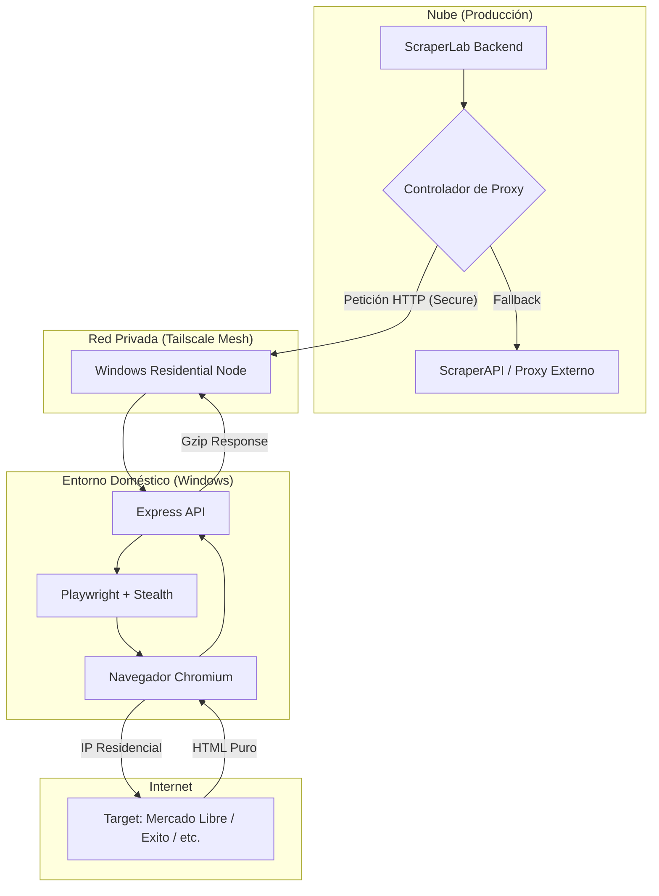

# Arquitectura: Nodo de Scraping Residencial Privado

Esta arquitectura describe el sistema de extracción de datos utilizando infraestructura doméstica ("Home-grown") para evitar bloqueos y reducir costos de servicios externos como ScraperAPI.

## Descripción General

El sistema se basa en desacoplar la **lógica de extracción** (qué datos queremos) de la **ejecución de red** (desde dónde pedimos los datos). Al usar una conexión residencial real y hardware dedicado (Windows PC), se minimiza la huella de detección de bots.

## Diagrama de Flujo

## Componentes Técnicos

### 1. Conectividad: Tailscale
- **Seguridad:** Utiliza el protocolo WireGuard® para crear una red privada punto a punto.
- **Transparencia:** No requiere apertura de puertos (Port Forwarding) ni configuración de DNS público.
- **Acceso:** El servidor de producción se comunica con el nodo de Windows mediante una IP interna fija (ej. `100.x.y.z`).

### 2. Nodo de Ejecución: Windows PC
- **Motor de Navegación:** Playwright con el plugin `stealth`. Esto emula comportamientos humanos, WebGL, y huellas digitales de hardware real.
- **API Wrapper:** Un servidor Express mínimo que escucha peticiones `POST /fetch`.
- **Ventajas:** Permite renderizar JavaScript pesado sin costo adicional y maneja sesiones/cookies de forma persistente si es necesario.

### 3. Fallback y Resiliencia
- El sistema está diseñado para que, si el nodo de Windows no está disponible (ej. PC apagado o internet caído), el backend conmute automáticamente a un proveedor de respaldo (ScraperAPI).

## Seguridad y Autenticación
- **Tailscale ACLs:** Solo el servidor de producción tiene permiso para conectarse al puerto `3000` del nodo de Windows.
- **API Key:** Cada petición incluye un header `x-api-key` validado por el nodo de Windows para prevenir accesos no autorizados dentro de la red privada.

## Guía de Despliegue (Resumen)
1. Instalar Tailscale en Windows y Servidor.
2. Instalar Node.js y Playwright en Windows (`npx playwright install chromium`).
3. Ejecutar `scraper-node/server.js`.
4. Configurar la IP del nodo en las variables de entorno del Backend (`RESIDENTIAL_NODE_URL`).
