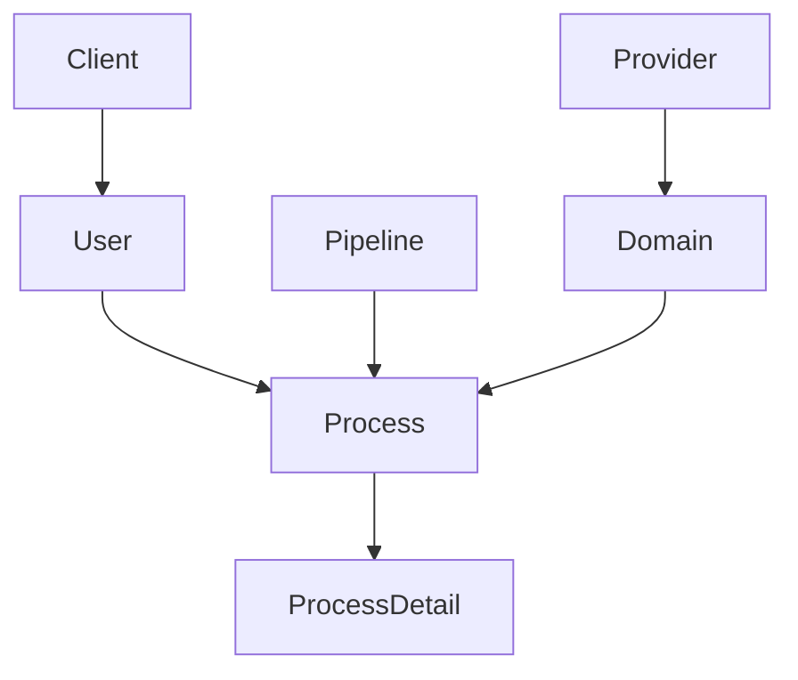

# 🏗️ Modelo de Datos - ScraperLab

Este documento describe la arquitectura de datos de **ScraperLab**, detallando las tablas de DynamoDB, sus índices, esquemas de ítems y las relaciones entre entidades.

---

## 📊 Tablas y Índices (GSI)

ScraperLab utiliza una arquitectura de microservicios con múltiples tablas en DynamoDB para gestionar proveedores, dominios, pipelines y el historial de ejecuciones.

### 1. `ScraperLab-Providers`
Almacena la configuración de los proveedores de scraping (ScraperAPI, Oxylabs, etc.).
- **PK**: `providerId` (String)

### 2. `ScraperLab-Domains`
Configuración específica por dominio (selectores, rate limits).
- **PK**: `domainId` (String) - Ej: `amazon.com`, `mercadolibre.com.co`
- **GSI**: `providerId-index` (Partition: `providerId`)

### 3. `ScraperLab-Pipelines`
Definiciones de flujos de trabajo compuestos por nodos.
- **PK**: `pipelineId` (String)

### 4. `ScraperLab-Nodes`
Nodos individuales utilizados en las pipelines.
- **PK**: `nodeId` (String)

### 5. `ScraperLab-Process` (Logs de Ejecución)
Registro de cada ejecución de scraping o pipeline.
- **PK**: `logId` (UUID)
- **GSI1**: `domainId-timestamp-index` (Partition: `domainId`, Sort: `timestamp`)
- **GSI2**: `userId-timestamp-index` (Partition: `userId`, Sort: `timestamp`)

### 6. `ScraperLab-Process-Detail`
Detalle paso a paso de cada nodo ejecutado dentro de un proceso.
- **PK**: `detailId` (UUID)
- **GSI1**: `processId-timestamp-index` (Partition: `processId`, Sort: `timestamp`)

### 7. `ScraperLab-Users` & `ScraperLab-Clients`
Gestión de acceso y multi-tenancy.
- **Users PK**: `userId` (String) | `email` (GSI)
- **Clients PK**: `clientId` (String)

---

## 🛠️ Esquemas de ítems (Ejemplos JSON)

### 🏢 Proveedor (`PROVIDER`)
```json
{
  "providerId": "scraperapi",
  "name": "ScraperAPI",
  "baseUrl": "https://api.scraperapi.com/",
  "authType": "api_key",
  "configSchema": {
    "render": { "type": "boolean", "default": true },
    "premium": { "type": "boolean", "default": false },
    "country_code": { "type": "string", "default": "us" }
  },
  "enabled": true,
  "createdAt": "2026-01-30T10:00:00Z"
}
```

### 🌐 Dominio (`DOMAIN`)
```json
{
  "domainId": "alkosto.com",
  "providerId": "scraperapi",
  "providerConfig": {
    "render": true,
    "premium": true,
    "country_code": "co",
    "wait": 2000
  },
  "selectors": {
    "priceSelector": ".alk-main-price",
    "titleSelector": "h1.product-title",
    "imageSelector": "img.product-image"
  },
  "enabled": true,
  "updatedAt": "2026-01-30T10:00:00Z"
}
```

### 🚀 Proceso (`PROCESS`)
```json
{
  "logId": "uuid-123",
  "processId": "uuid-123",
  "processType": "pipeline", // simple | batch | pipeline
  "pipelineId": "oferty-product-gen",
  "status": "completed",
  "success": true,
  "domainId": "amazon.com",
  "url": "https://amazon.com/p/123",
  "userId": "user-456",
  "timestamp": "2026-03-31T20:00:00Z",
  "input": { "sku": "IPH16PM", "category": "Celulares" },
  "output": { "price": 4500000, "status": "updated" },
  "ttl": 1746057600
}
```

### 🔍 Detalle del Proceso (`PROCESS_DETAIL`)
```json
{
  "detailId": "detail-uuid-789",
  "processId": "uuid-123",
  "step": "rag_search",
  "nodeType": "ai_search",
  "success": true,
  "responseTime": 1250,
  "input": { "query": "iPhone 16 Pro Max" },
  "output": { "context": "Found 3 similar products..." },
  "timestamp": "2026-03-31T20:00:05Z"
}
```

### 🔗 Pipeline (`PIPELINE`)
```json
{
  "pipelineId": "oferty-product-gen",
  "name": "Generación de Productos Oferty",
  "description": "Pipeline para buscar, analizar y crear productos vía IA",
  "nodes": [
    { "id": "node-1", "type": "rag_search", "config": { "limit": 5 } },
    { "id": "node-2", "type": "ai_generator", "config": { "model": "gemini-2.0" } }
  ],
  "active": true,
  "updatedAt": "2026-03-25T15:00:00Z"
}
```

### 👥 Cliente (`CLIENT`)
```json
{
  "clientId": "oferty",
  "name": "Oferty S.A.S",
  "allowedUsers": ["admin@oferty.com", "dev@oferty.com"],
  "isActive": true,
  "config": { "maxThreads": 5, "priority": "high" },
  "createdAt": "2026-01-01T10:00:00Z",
  "updatedAt": "2026-03-31T12:00:00Z"
}
```

### 👤 Usuario (`USER`)
```json
{
  "userId": "auth0|123456",
  "email": "admin@oferty.com",
  "name": "Admin Oferty",
  "role": "admin",
  "lastLogin": "2026-03-31T20:00:00Z",
  "createdAt": "2026-01-15T08:00:00Z"
}
```

---

## 🔄 Relaciones



> [!TIP]
> Todos los campos de fecha están en formato **ISO 8601** (UTC) a menos que se especifique lo contrario. Los campos `ttl` se usan para la limpieza automática de DynamoDB después de 90 días.
