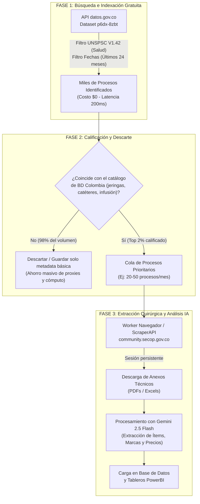

# Estrategia Técnica: Extracción del Detalle de Procesos en SECOP II

> **Propósito:** Documento de referencia arquitectónica para la extracción, estructuración y análisis de procesos de contratación pública de SECOP II en **ScraperLab**, optimizando costos operativos, velocidad y evasión de bloqueos.

---

## 1. El Reto: Comprender los Dos Niveles de Información

Al consultar el "detalle" de un proceso en SECOP II (por ejemplo, a partir de una URL como `https://community.secop.gov.co/Public/Tendering/OpportunityDetail/Index?noticeUID=CO1.NTC.10950170`), la información se divide en **dos niveles tecnológicos radicalmente distintos**:

```
                               ┌────────────────────────────────────────────────────────┐
                               │             DETALLE DE UN PROCESO SECOP II            │
                               └──────────────────────────┬─────────────────────────────┘
                                                          │
                    ┌─────────────────────────────────────┴─────────────────────────────────────┐
                    ▼                                                                           ▼
     ┌─────────────────────────────┐                                             ┌─────────────────────────────┐
     │   NIVEL 1: METADATOS Y      │                                             │   NIVEL 2: DOCUMENTOS       │
     │   DATOS DEL CONTRATO (95%)  │                                             │   Y ANEXOS FÍSICOS (PDF/XLS)│
     ├─────────────────────────────┤                                             ├─────────────────────────────┤
     │ • Entidad, NIT, Municipio   │                                             │ • Pliegos de condiciones    │
     │ • Objeto y Descripción      │                                             │ • Estudios previos          │
     │ • Presupuesto base/Cuantía  │                                             │ • Anexo técnico (ítem, marca)│
     │ • Fechas y Cronograma       │                                             │ • Actas de adjudicación     │
     │ • Proveedor adjudicado      │                                             │                             │
     │ • Código UNSPSC, Estado     │                                             │                             │
     ├─────────────────────────────┤                                             ├─────────────────────────────┤
     │ FUENTE: API datos.gov.co    │                                             │ FUENTE: community.secop...  │
     │ COSTO: $0 | TIEMPO: ~200 ms │                                             │ PROTEGIDO: Google reCAPTCHA │
     └─────────────────────────────┘                                             └─────────────────────────────┘
```

---

## 2. Nivel 1: Datos y Metadatos del Proceso (API Abierta)

El **95% de los datos estructurados** de una licitación no requieren visitar la web transaccional de SECOP II. Están disponibles directamente en la plataforma oficial de Datos Abiertos del Estado Colombiano.

### 2.1. Datasets Oficiales Disponibles

| Dataset ID | Nombre del Dataset | Contenido Clave |
| :--- | :--- | :--- |
| **`p6dx-8zbt`** | **SECOP II - Procesos de Contratación** | Ficha completa del proceso: Entidad, NIT, objeto, cuantía base, fechas, estado, modalidad, tipo de contrato, código UNSPSC, proveedor invitado/adjudicado, enlace directo `urlproceso.url`. |
| **`jbjy-vk9h`** | **SECOP II - Contratos Electrónicos** | Información contractual post-adjudicación: Proveedor ganador, NIT/Cédula, representante legal, valor final contratado, valor facturado, pagos, fecha de firma y supervisores. |

### 2.2. Ventajas Técnicas
* **Costo Operativo:** **$0** (no consume créditos de proxies como ScraperAPI u Oxylabs; utiliza `DirectAPIStrategy`).
* **Velocidad de Respuesta:** **200 ms – 300 ms** por petición.
* **Cero Captchas y Bloqueos:** Endpoint REST público sin WAF ni retos de Cloudflare.
* **Filtrado Dinámico SoQL:** Permite consultar por fecha (`$where=fecha_de_publicacion_del >= '...'`), código de categoría médica (`starts_with(codigo_principal_de_categoria, 'V1.42')`), referencia o ID de proceso.

### 2.3. Cómo Consultar un Detalle Específico desde ScraperLab

En la pantalla **Consultar** (`/admin/consultar`), seleccionar tipo **📦 Detalle de Producto**:

* **Por Referencia del Proceso:**
  ```text
  https://www.datos.gov.co/resource/p6dx-8zbt.json?referencia_del_proceso=04-05-09-26
  ```
* **Por ID interno de SECOP II:**
  ```text
  https://www.datos.gov.co/resource/p6dx-8zbt.json?id_del_proceso=CO1.REQ.11094096
  ```

---

## 3. Nivel 2: Documentos y Anexos Físicos (Portal Web SECOP II)

Cuando el caso de uso requiere extraer las **listas de ítems, cantidades, marcas solicitadas y precios unitarios ofertados**, dicha información reside en los documentos adjuntos (PDFs y archivos Excel).

### 3.1. El Reto de Seguridad en `community.secop.gov.co`

Al solicitar directamente cualquier URL de oportunidad:
```text
https://community.secop.gov.co/Public/Tendering/OpportunityDetail/Index?noticeUID=CO1.NTC.10950170
```

1. **Redirección de WAF:** El servidor detecta una petición sin sesión previa válida y redirige forzosamente mediante HTTP 302 / JavaScript a:
   ```text
   /Public/Common/GoogleReCaptcha/Index?previousUrl=https%3a%2f%2fcommunity.secop.gov.co%2f...
   ```
2. **Google reCAPTCHA Enterprise:** Bloquea peticiones simples (`curl`, `axios`, `fetch`) y exige resolver el reto "No soy un robot".
3. **Almacenamiento de Archivos:** Una vez superada la barrera, los enlaces de descarga apuntan a:
   * `/Public/Tendering/OpportunityDetail/DownloadAttachment?noticeUID=...&attachmentUID=...`
   * Azure Blob Storage: `https://accesopublicosecopiiprod.blob.core.windows.net/...`

---

## 4. Opciones de Extracción para el Nivel 2 (Web de SECOP II)

| Estrategia | Mecanismo | Pros | Contras | Costo Estimado |
| :--- | :--- | :--- | :--- | :--- |
| **Opción A: Proxies con Render Headless (ScraperAPI / Oxylabs)** | Se envía la URL a ScraperAPI con `render=true` y `ultra_premium=true`. El servicio levanta un navegador en la nube, resuelve el captcha y entrega el HTML renderizado. | • Cero infraestructura propia.<br>• Integración directa con el provider `scraperapi` en ScraperLab. | • Mayor latencia (15-30s por página).<br>• Alto consumo de créditos premium si se ejecuta masivamente. | ~$3 - $10 USD por cada 1.000 peticiones. |
| **Opción B: Worker Headless con Sesión Persistente (Recomendada)** | Un contenedor con Playwright/Puppeteer abre SECOP II, resuelve el captcha inicial **una sola vez** (vía CapSolver / 2Captcha a $0.001 USD) y guarda la cookie `PublicSessionCookie` + `ROUTEID`. | • Con una sola sesión abierta se pueden descargar decenas de procesos y PDFs seguidos sin volver a pagar por captcha.<br>• Muy alta velocidad. | • Requiere orquestar un worker con navegador (Docker / ECS / Batch). | **Casi $0** (~$0.05 USD / día de operación). |
| **Opción C: Datasets de Archivos Históricos de Datos Abiertos** | Consultar los datasets consolidados de referencias de descarga anuales (`3skv-9na7`, `kgcd-kt7i`). | • Acceso masivo a URLs de descarga pasadas sin navegar la web. | • No siempre incluye los anexos de procesos publicados en las últimas 24-48 horas. | $0 |

---

## 5. Arquitectura Óptima: Embudo de Filtrado Inteligente

Para que el pipeline sea técnica y económicamente viable, **jamás se debe scrapear la web de SECOP II de forma masiva para buscar**. Se implementa un **embudo en 3 fases**:



---

## 6. Configuración de Dominios en ScraperLab

### 6.1. Dominio `datos.gov.co` (Búsqueda y Detalle Metadata)
* **Archivo de Configuración:** `logs/scraperConfig/domain-datos.gov.co.json`
* **Provider:** `api` (`DirectAPIStrategy`)
* **Uso:** Indexación continua, alertas en tiempo real de nuevos procesos y ficha de metadatos generales.

### 6.2. Dominio `community.secop.gov.co` (Descarga de Documentos)
* **Archivo de Configuración:** `.logs/scraperConfig/domain-community.secop.gov.co.json`
* **Provider:** `scraperapi` / Worker Headless
* **Parámetros Requeridos:**
  ```json
  {
    "render": true,
    "ultra_premium": true,
    "country_code": "co",
    "wait": 5000,
    "wait_for_selector": "table[id*='gridDocuments'], .attachment-list"
  }
  ```
* **Uso:** Exclusivamente para la extracción quirúrgica de documentos de procesos previamente calificados.

---

## 7. Conclusión y Siguientes Pasos

1. **Para consultas inmediatas en la plataforma:** Utilizar la API de `datos.gov.co` en `/admin/consultar` con los identificadores `referencia_del_proceso` o `id_del_proceso`.
2. **Para la fase de anexos técnicos del proyecto BD Colombia:** Implementar el orquestador de descargas quirúrgicas sobre los procesos filtrados por la categoría `V1.42`, minimizando las solicitudes con renderizado a la web transaccional.
